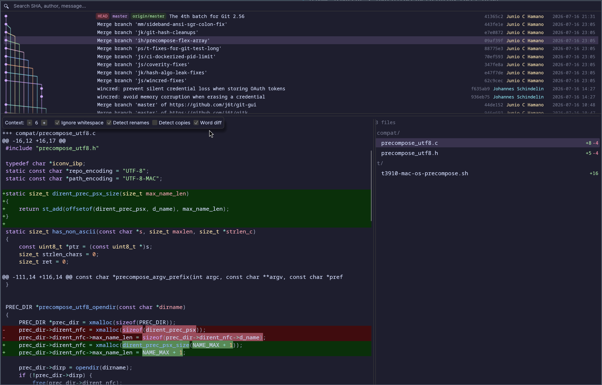

<h1 align="center">
  <br>
  gitkay
  <br>
</h1>

<h3 align="center">gitk, but okay.</h3>

<p align="center">
  A fast, native Wayland git history viewer built with Rust.
</p>

<p align="center">
  <a href="#features">Features</a> •
  <a href="#install">Install</a> •
  <a href="#usage">Usage</a> •
  <a href="#why">Why</a> •
  <a href="#license">License</a>
</p>

<p align="center">
  
</p>

---

## Why?

**gitk** is a Tcl/Tk app from 2005. On Wayland it needs XWayland, has stale X11 selection bugs, and looks like it time-traveled from Windows 98.

**gitkay** is what gitk would be if it was written today:

- Native Wayland — no XWayland, no Tk, no X11 selection bugs
- Starts in **under 200ms** — lazy loading, precomputed ref maps
- Catppuccin Mocha dark theme that matches your rice
- Written in Rust, single binary — works with zero config, optional config file for fonts

## Features

### Commit Graph
- Color-coded branch lanes with consistent colors across column shifts
- Merge/branch diagonals rendered cleanly — no stubs, no gaps, no false branches
- Lane-based layout: first parent always continues straight down
- Convergence detection when multiple branches meet at one commit
- Virtual scrolling with lazy loading — handles repos with thousands of commits

### Diff Viewer
- True syntax-highlighted diffs (syntect): language-aware token colors over the chosen theme's background, with green/red row tints and a +/- gutter for additions/deletions
- Selectable color theme via `[syntax] theme` in the config (any of 29 bundled themes — a curated allowlist; default Catppuccin Mocha), applied live on save; or turn highlighting off for the original flat per-line coloring
- File list sidebar with per-file `+/-` stats
- Click a file to jump to its diff section
- Commit header with author, date, full message

### Search
- Full-width search bar — filter by SHA, author, commit message, branch name, tag name
- **Just start typing** — any keypress focuses the search bar instantly
- Press **Enter** to cycle through matches with `3/42` counter
- Graph auto-scrolls to the matched commit
- Matching commits marked with a yellow accent bar

### Quality of Life
- **Click a commit** to copy its SHA to both clipboard and primary selection
- **Auto-select** first commit on startup with diff shown
- **Lazy loading** — starts with 200 commits, loads more as you scroll
- **Unique author colors** — each contributor gets a distinct color
- **Unique ref colors** — each branch/remote gets its own color with readable contrast
- **Ref badges** — colored labels for HEAD, branches, remotes, tags
- **Hover effects** — file list highlights on hover with full path tooltip

## Install

### Gentoo

Packaged in the [GURU](https://wiki.gentoo.org/wiki/Project:GURU) overlay.

```sh
# Enable the GURU repository (needs app-eselect/eselect-repository)
sudo eselect repository enable guru
sudo emaint sync -r guru

sudo emerge --ask dev-vcs/gitkay
```

### From source (recommended)

```sh
git clone https://github.com/Marenz/gitkay
cd gitkay
cargo build --release
sudo cp target/release/gitkay /usr/local/bin/
```

### Build dependencies

**openSUSE Tumbleweed:**
```sh
sudo zypper install gtk4-devel libgraphene-devel openssl-devel
```

**Ubuntu / Debian:**
```sh
sudo apt install libgtk-4-dev libgraphene-1.0-dev libssl-dev pkg-config cmake
```

**Fedora:**
```sh
sudo dnf install gtk4-devel graphene-devel openssl-devel
```

### openSUSE RPM

```sh
rpmbuild -ba packaging/gitkay.spec
sudo rpm -i ~/rpmbuild/RPMS/x86_64/gitkay-*.rpm
```

### Ubuntu / Debian .deb

```sh
dpkg-buildpackage -us -uc -b
sudo dpkg -i ../gitkay_*.deb
```

## Usage

```sh
# Inside a git repo
gitkay

# Or specify a path
gitkay /path/to/repo
```

### Controls

| Action | Effect |
|---|---|
| **Click** commit | Select, show diff, copy SHA to clipboard |
| **↑ / ↓** | Select previous / next commit (view follows) |
| **Scroll** | Browse history (lazy loads more commits) |
| **Start typing** (anywhere) | Focus search bar and filter by SHA / author / message / branch / tag |
| **Enter** / **↑** / **↓** in search | Cycle through matches, graph scrolls to match |
| **Click** file in sidebar | Jump to file's diff section |
| **Hover** file in sidebar | Full path tooltip |

## Architecture

Rust app (~2900 lines in `src/main.rs`, plus `src/config.rs` for fonts + syntax
config and `src/highlight.rs` for syntect highlighting) with 66 unit tests:

- **egui** + **eframe** — native Wayland window with wgpu rendering
- **git2** (libgit2) — repository access, revwalk, diff
- **syntect** + **two-face** — language-aware diff syntax highlighting (pure-Rust fancy-regex backend, no C deps)
- **chrono** — date formatting
- **arboard** — clipboard (both clipboard and primary selection)

The graph layout uses a pipe-based algorithm where each lane tracks an OID and a persistent color index. First parent always continues in the same column. Colors survive column shifts. Convergence is detected when multiple lanes point to the same commit.

## Configuration

gitkay runs with no configuration. To customise it, edit
`~/.config/gitkay/config.toml` — a fully-commented template with every default is
written on first run. Changes apply live on save; no restart needed.

**Fonts** (`[fonts]`, `[sizes]`, `[families]`): set a monospace and a proportional
font family (by installed name, resolved from installed system fonts, or by explicit
file path) and a size plus family for each text role: `diff`, `commit_summary`,
`commit_meta`, `refs`, `file_list`, and `ui`.

**Diff syntax highlighting** (`[syntax]`):

| Key | Default | Meaning |
|-----|---------|---------|
| `enabled` | `true` | `false` restores the original flat per-line coloring (no theme, no highlighter) |
| `theme` | `"catppuccin-mocha"` | one of 29 bundled themes (e.g. `dracula`, `nord`, `gruvbox-dark`, `github`, `solarized-light`); unknown values warn and fall back |
| `diff_background` | `"fixed"` | `"fixed"` uses the band colors below; `"theme"` derives add/remove backgrounds from the active theme |
| `added_background` / `deleted_background` | built-in dark/light | explicit `"#rrggbb"` band colors for `"fixed"` mode |

## License

[MIT](LICENSE)
