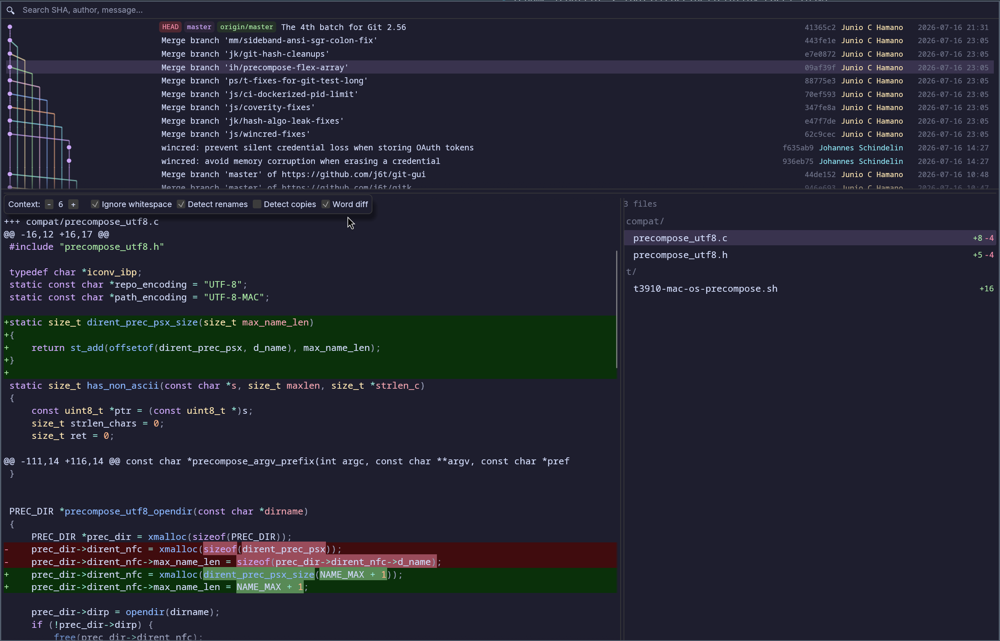

<h1 align="center">
  <br>
  gitkay
  <br>
</h1>

<h3 align="center">gitk, but okay.</h3>

<p align="center">
  A fast, native Wayland git history viewer built with Rust.
</p>

<p align="center">
  <a href="#features">Features</a> •
  <a href="#usage">Usage</a> •
  <a href="#architecture">Architecture</a> •
  <a href="#configuration">Configuration</a> •
  <a href="#install">Install</a> •
  <a href="#license">License</a>
</p>

<p align="center">
  
</p>

---

> [!NOTE]
> This is a fork of [Marenz/gitkay](https://github.com/Marenz/gitkay), developed
> entirely with [Claude](https://www.claude.com/product/claude-code). It's my daily
> git viewer, and the fork has grown the features I kept reaching for in real
> day-to-day work, along with steady UX and DX polish.

## Why?

**gitk** is a Tcl/Tk app from 2005. On Wayland it needs XWayland, has stale X11 selection bugs, and looks like it time-traveled from Windows 98.

**gitkay** is what gitk would be if it was written today:

- Native Wayland — no XWayland, no Tk, no X11 selection bugs
- **Opens straight away** — the history walk, font scan and syntax set all load off the startup path, and the list is virtualized rather than built up front
- Catppuccin Mocha dark theme that matches your rice
- Written in Rust, single binary — works with zero config, and a live-reloaded
  [config file](#configuration) when you want fonts, themes, columns or caching your way

## Features

### Commit Graph
- Color-coded branch lanes with consistent colors across column shifts
- Merge/branch diagonals rendered cleanly — no stubs, no gaps, no false branches
- Lane-based layout: first parent always continues straight down
- Convergence detection when multiple branches meet at one commit
- Selecting a commit highlights its branch — its ancestry (including merged-in history) stays bright while unrelated commits dim
- Virtual scrolling with lazy loading — handles repos with thousands of commits

### Diff Viewer
- True syntax-highlighted diffs (syntect): language-aware token colors over the chosen theme's background, with green/red row tints and a +/- gutter for additions/deletions
- Selectable color theme via `[diff] theme` in the config (any of 29 bundled themes — a curated allowlist; default Catppuccin Mocha), applied live on save; or turn highlighting off for the original flat per-line coloring
- File list sidebar with per-file `+/-` stats, grouped under directory headers by default (`[diff] file_list` = `grouped`/`full`/`name`)
- Renamed/copied files shown git-style — one `dir/{old ⇒ new}` entry instead of a delete + add pair
- **Word diff** toggle — highlights the exact words that changed within a modified line
- Hover toolbar on the diff: context-line count, ignore whitespace, rename/copy detection, word diff
- Highlighting runs in the background, on-screen files first — large diffs never block the UI; diffs are cached and the neighbouring commits prefetched, so stepping through history is instant
- Click a file to jump to its diff section; the sidebar tracks your position, highlighting the file under the diff view as you scroll
- Commit header with author, date, full message

### Staging, Unstaging and Reverting
- **Right-click a hunk** in the diff, or **a file** in the sidebar, to act on it
- The verb follows the row: **Stage** on *Uncommitted changes*, **Unstage** on
  *Staged changes*, **Revert** on a real commit or an `a..b` range row
- Every action is reversible, so nothing prompts — and every decision is taken
  *before* anything is written: a diff that moved on since you looked is
  refused as stale rather than applied to content you never saw
- Whole-file stage/unstage go straight to the index, so binaries, mode changes,
  CRLF and missing trailing newlines are exact rather than patched
- What it won't do, it says plainly: a rename or copy names the whole-file
  action that works instead, and a hunk hidden by "ignore whitespace" names
  the toggle to turn off

### Search
- Full-width search bar — filter by SHA, author, commit message, branch name, tag name
- **Just start typing** — any keypress focuses the search bar instantly
- Press **Enter** to cycle through matches with `3/42` counter
- Graph auto-scrolls to the matched commit
- Matching commits marked with a yellow accent bar

### Quality of Life
- **Click a commit** to copy its SHA to both clipboard and primary selection
- **Uncommitted / staged rows** — working-tree and index changes appear as rows at the top of the list, whenever you haven't named a revision (or passed `--all`)
- **Live view** — `.git` (refs, HEAD, index) is watched, so the graph reloads itself after a commit, fetch, or rebase
- **Combined range row** — `gitkay v1.0..main` adds a row for the range as a whole, diffed end to end
- **Warm across launches** — built diffs are cached on disk, so a commit with huge blobs but a small patch is not rebuilt every time you open it
- **Persistent layout** — window size/position, the panel splitters and the diff toolbar's settings survive restarts
- **Auto-select** first commit on startup with diff shown
- **Lazy loading** — starts with 200 commits, loads more as you scroll
- **Unique author colors** — each contributor gets a distinct color
- **Local commit times** — dates render in each commit's recorded timezone, not UTC
- **Unique ref colors** — each branch/remote gets its own color with readable contrast
- **Ref badges** — colored labels for HEAD, branches, remotes, tags
- **Hover effects** — file list highlights on hover with full path tooltip

## Usage

```sh
gitkay                          # the current branch, in the repo you're standing in
gitkay -C /path/to/repo         # a repo elsewhere
gitkay --all                    # every ref: branches, remotes, tags
gitkay --first-parent           # the mainline only: one row per merge
gitkay main                     # one revision's history
gitkay v1.0..main               # a range (adds a row for the range as a whole)
gitkay --combined v1.0..main    # ...and open on that combined row
gitkay -- src/ docs/            # only commits touching these paths
gitkay --follow src/main.rs     # one file across renames, like git log --follow -p
gitkay --reflog                 # HEAD's reflog instead of its history
gitkay --reflog origin/main     # some other ref's reflog
```

### Options

| Option | Effect |
|---|---|
| `-C <dir>` | Run as if started in `<dir>` |
| `--all` | Show all refs (branches, remotes, tags), not just the current branch |
| `--first-parent` | Follow only the first parent of each merge — show the mainline, hiding commits merged in from topic branches. The graph collapses to a single lane |
| `--combined` | Open on the combined diff of a single `<a>..<b>` range. The row is always present for a range; this selects it |
| `--reflog [<ref>]` | Show `<ref>`'s reflog (default `HEAD`) instead of its history |
| `--follow <path>` | Follow exactly one path across renames |
| `-h`, `--help` / `-V`, `--version` | Print help / version and exit |

Positional arguments work like git's: `<rev>`, `<a>..<b>`, `<a>...<b>` and
`^<rev>` scope the history, and paths limit it to commits touching them
(relative to the current directory). gitkay works out which is which on its
own; you need `--` only when a name is both — it says so rather than guessing —
or when the path no longer exists, since after `--` paths are taken verbatim.

The **uncommitted** and **staged** rows appear when you pass no revision at all
(the default) or `--all`. Naming a revision hides them, even if it is the branch
you have checked out. They honour an active path filter, so an edit outside
`-- src/` does not put a row on the list.

### Controls

| Action | Effect |
|---|---|
| **Click** commit | Select, show diff, copy SHA to clipboard *and* primary selection |
| **↑ / ↓** | Select previous / next commit (view follows) |
| **Scroll** | Browse history (lazy loads more commits) |
| **Start typing** (anywhere) | Focus the search bar; filters by SHA / author / message / branch / tag |
| **Enter** / **↑** / **↓** in search | Cycle matches with an `n/total` counter; the graph scrolls to each |
| **Esc** | Dismiss a write error (when no menu is open) |
| **Click** file in sidebar | Jump to that file's section of the diff |
| **Hover** file in sidebar | Full path tooltip |
| **Right-click** hunk or file | Stage / Unstage / Revert it — see above |
| **PageUp / PageDown** | Jump to the previous / next file in the diff |
| **Space / Shift+Space** | Scroll the diff down / up by half a page |
| **Hover** the diff | Toolbar: context lines, ignore whitespace, rename/copy detection, word diff |

Selecting a commit dims everything outside its ancestry, so a branch stands out
against the rest of the graph; merged-in history stays bright.

## Architecture

One immediate-mode egui app. `src/main.rs` holds the commit graph, the workers
and the UI; the rest is split by concern:

| Module | Concern |
|---|---|
| `diff.rs` | The diff data layer — building, shaping and looking up diffs; git2-facing and egui-free |
| `apply.rs` | The write layer — stage, unstage and revert, and every guard that decides against writing |
| `highlight.rs` | syntect: theme and palette resolution, grammar selection, per-line tokenizing |
| `diff_cache.rs` | In-memory LRU diff cache, bounded by total lines |
| `diff_store.rs` | The persistent layer below it — binary codec, key derivation, pruning |
| `config.rs` | TOML config, font resolution, the commented template |
| `cli.rs` | Argument parsing and rev-vs-path classification |
| `word_diff.rs` | Intra-line word diffing (tokenizer + LCS alignment) |
| `mem.rs` | What the system will say about available memory |

Built on:

- **egui** + **eframe** — native Wayland window, rendered with wgpu (eframe's
  default backend; Vulkan, with a GLES fallback — the `glow` feature is off)
- **git2** (libgit2) — repository access, revwalk, diff
- **syntect** + **two-face** — language-aware highlighting (pure-Rust fancy-regex backend, no C deps)
- **chrono** — date formatting
- **arboard** — clipboard (both clipboard and primary selection)

Three ideas carry most of the design:

**The graph layout** is pipe-based: each lane tracks an OID and a persistent
colour index, the first parent always continues in the same column, colours
survive column shifts, and convergence is detected when several lanes point at
the same commit. That last invariant is what keeps merges from drawing false
diagonals.

**Startup is treated as a latency budget.** The history walk, the system font
scan and the syntax-set load all run on threads that overlap window and GL
creation, and the first diff is computed after the first frame is on screen
rather than before it — so the window appears while the expensive parts are
still finishing.

**Nothing expensive runs on the frame loop.** Diffs are built, highlighted and
prefetched on a worker pool that schedules itself by distance from what you are
looking at; both scrolled lists are virtualized; and word-diff emphasis is
computed only for the rows actually on screen. Speculative work is deliberately
bounded, and rows whose blobs are enormous go to a separate lane admitted
against available memory, so warming the cache never competes with the diff you
are waiting for.

## Configuration

gitkay runs with no configuration at all. To change something, edit
`~/.config/gitkay/config.toml` — a fully-commented template with every default
is written there on first run, so you can uncomment lines rather than look
anything up.

Three things worth knowing before the reference below:

- **Changes apply live on save.** No restart. A font change is picked up on a
  background thread, so saving never freezes the window.
- **Unknown keys are an error**, not silently ignored, so a typo surfaces
  immediately instead of quietly doing nothing.
- **A broken config keeps the current look.** On startup gitkay falls back to
  defaults; on a live reload it keeps what it is already showing and tells you,
  both in the log and as an on-screen notice — so a half-saved edit never blanks
  your window, and you find out immediately rather than wondering why nothing
  changed.

Everything is optional — an omitted key, section or whole file means the
default.

**Sections:**
[`[fonts]`](#fonts-where-text-comes-from) ·
[`[text]`](#text-size-and-family-per-role) ·
[`[diff]`](#diff-the-diff-pane) ·
[`[diff.languages]`](#difflanguages-grammars-for-your-own-extensions) ·
[`[diff.bands]`](#diffbands-the-addremove-row-tints) ·
[`[commit_list]`](#commit_list-the-columns-beside-each-commit) ·
[`[cache]`](#cache-the-on-disk-diff-store)

### `[fonts]` — where text comes from

Two font sources that every text role draws from.

| Key | Default | Meaning |
|---|---|---|
| `monospace` | bundled | Installed family name, e.g. `"JetBrains Mono"` |
| `proportional` | bundled | Installed family name, e.g. `"Inter"` |
| `monospace_path` | — | Explicit font file; skips the name lookup entirely |
| `proportional_path` | — | Explicit font file; skips the name lookup entirely |

```toml
[fonts]
monospace = "JetBrains Mono"
proportional = "Inter"
```

A **name** is resolved against your installed fonts, and the resolved path is
cached in `~/.cache/gitkay/fonts.toml` so later launches skip the system scan.
A name that cannot be resolved is *not* cached — it is warned about on every
launch, so a typo is visible rather than silently falling back forever. A
**path** skips both the lookup and the cache.

### `[text]` — size and family per role

Each role takes `{ size, font }`, where `font` is `"monospace"` or
`"proportional"` (which of the two sources above to use). Omit either key to
keep that role's default.

| Role | Default size | What it covers |
|---|---|---|
| `diff` | 13 | The diff pane |
| `commit_summary` | 13 | Commit subject lines in the list |
| `commit_meta` | 12 | Date, SHA, author, the stats column |
| `refs` | 11 | Branch / tag / remote badges |
| `file_list` | 12 | The file sidebar (its `+`/`-` counts render 2px smaller) |
| `ui` | 13 | Search bar and diff toolbar |

```toml
[text]
diff = { size = 14 }                              # keep the default family
commit_summary = { size = 14, font = "proportional" }
refs = { font = "proportional" }                  # keep the default size
```

All roles default to monospace. Sizes are clamped to **4–64**, so a stray `0`
or `500` cannot make the window unusable.

### `[diff]` — the diff pane

| Key | Default | Meaning |
|---|---|---|
| `syntax` | `true` | Syntax-highlight diffs. `false` restores flat per-role colouring — no theme, no highlighter |
| `theme` | `"catppuccin-mocha"` | Highlight theme; one of the 29 slugs below. An unknown value warns and falls back |
| `show_stats` | `true` | Show the diffstat block between the commit message and the patch. The file sidebar is independent and always shown |
| `file_list` | `"grouped"` | Sidebar layout: `"grouped"` puts files under directory headers, `"full"` shows full repo-relative paths, `"name"` shows basenames only |
| `detect_renames` | `true` | Show a rename as one `old → new` entry instead of a delete + add (git `-M`) |
| `detect_copies` | `false` | Show a file copied from another *modified* file as `source → copy` (git `-C`). More expensive than renames |

`detect_renames` and `detect_copies` are also on the diff's hover toolbar. The
config is authoritative: the toolbar is a session override, and a config reload
re-asserts the configured value over it.

<details>
<summary><strong>All 29 themes</strong></summary>

`catppuccin-mocha` (default), `catppuccin-macchiato`, `catppuccin-frappe`,
`catppuccin-latte`, `base16-ocean-dark`, `base16-ocean-light`,
`base16-eighties-dark`, `base16-mocha-dark`, `coldark-cold`, `coldark-dark`,
`dark-neon`, `dracula`, `github`, `gruvbox-dark`, `gruvbox-light`,
`inspired-github`, `leet`, `monokai-extended`, `monokai-extended-bright`,
`monokai-extended-light`, `monokai-extended-origin`, `nord`, `one-half-dark`,
`one-half-light`, `solarized-dark`, `solarized-light`, `sublime-snazzy`,
`two-dark`, `zenburn`

They come from [two-face](https://github.com/CosmicHorrorDev/two-face) — the
[bat](https://github.com/sharkdp/bat) theme collection. gitkay picks light or
dark band colours to match the theme you choose.

</details>

### `[diff.languages]` — grammars for your own extensions

Map a file extension to a syntax. Without one, a file whose suffix syntect has
no grammar for falls back to plain text — which still renders, just in a single
flat colour, and *looks* highlighted. gitkay reports each such extension once
per session, at `info`: most repos hold a few suffixes with no grammar and
nothing is broken when they fall back, so a plain run stays quiet. Run
`RUST_LOG=gitkay=info gitkay` when a file renders flat and you want to know
whether a mapping would fix it. A file git calls binary is never reported — no
`[diff.languages]` entry could help it.

```toml
[diff.languages]
oml = "xml"        # by one of the syntax's own extensions
tfvars = "hcl"
props = "XML"      # ...or by syntax name
```

The key is an extension without the dot; the value is either a syntax name or
any extension that syntax already handles. Matching is case-insensitive, and
this map is consulted *before* the built-in lookup, so it can also override a
grammar you dislike.

### `[diff.bands]` — the add/remove row tints

The green/red backgrounds behind added and deleted lines, when `syntax = true`.

| Key | Default | Meaning |
|---|---|---|
| `source` | `"fixed"` | `"fixed"` uses the two colours below; `"theme"` derives them from the active theme's own diff colours |
| `added` | built-in | `"#rrggbb"` for added rows, in `"fixed"` mode |
| `deleted` | built-in | `"#rrggbb"` for deleted rows, in `"fixed"` mode |

The built-in defaults come in a dark and a light variant, chosen to match the
theme, so `"fixed"` still looks right on `solarized-light`.

```toml
[diff.bands]
source = "theme"
```

### `[commit_list]` — the columns beside each commit

| Key | Default | Meaning |
|---|---|---|
| `file_count` | `true` | Number of files the commit touched (`5f`) |
| `line_count` | `true` | Lines added and removed (`+42  -7`) |
| `author_chars` | `20` | Width of the author column, in characters. Clamped to 2–80 |
| `date` | `"absolute"` | `"absolute"` shows `2026-07-06 09:49` in the commit's own timezone; `"relative"` shows its age |

The stats column appears when **either** count is enabled, so all four
combinations mean something. `line_count = false` is a modest saving — around
20–45% of the column's cost, measured at ~4ms a commit on a 67k-commit repo and
~6ms on a 13k-commit one. Most of the cost is the diff itself, which the file
count needs too, so turning line counts off shortens the work rather than
removing it. It does cap the worst case, though: the slowest commit in that
sample took 66ms with line counts and 24ms without.

`author_chars` is a fixed width rather than per-row, which is the point — the
SHA, stats and date line up down the whole list instead of stepping in and out
as author names change. Longer names are elided, and keep their own colour.

`date = "relative"` is worded exactly as `git log --date=relative` is, down to
the rounding (`90 seconds` reads *2 minutes ago*, and 1–5 years takes git's
two-part `4 years, 11 months ago` form). The two working-tree rows show no date
in either mode — they have no timestamp to report.

```toml
[commit_list]
date = "relative"
line_count = false
```

### `[cache]` — the on-disk diff store

Built diffs are cached under `~/.cache/gitkay/diffs`, so a commit whose blobs
are huge but whose patch is small is not rebuilt on every launch. The win is
large where it applies: ~12s becomes ~1ms.

| Key | Default | Meaning |
|---|---|---|
| `min_build_ms` | `1000` | Store a diff once building it took at least this long, in milliseconds |

`0` stores everything; a very large value effectively turns the store off. It
is deliberately not clamped, because both extremes are coherent requests. The
store prunes itself to 256MB, evicting least-recently-used entries, and it
invalidates itself whenever the repo's diff-affecting config, its
`.gitattributes`, or gitkay's own version changes — so a stale entry cannot
outlive the thing that produced it. Deleting the directory is always safe.

### Files gitkay writes

| Path | What |
|---|---|
| `~/.config/gitkay/config.toml` | Your config; the commented template is written here on first run |
| `~/.cache/gitkay/diffs/` | The persistent diff store (see `[cache]`) |
| `~/.cache/gitkay/fonts.toml` | Resolved font-name → path cache |
| `~/.local/share/gitkay/` | Window geometry, splitter positions, and the diff toolbar's context / ignore-whitespace / word-diff settings |

Nothing outside these is touched, and every one of them is safe to delete.

### Logging

Warnings go to stderr by default — an unresolvable font name, a config parse
error, a history walk slow enough to have changed the rows under you. A missing
grammar is one level quieter, at `info`, since falling back to plain text breaks
nothing:

```sh
RUST_LOG=gitkay=info gitkay
```

For the full startup and per-phase timing breakdown:

```sh
RUST_LOG=gitkay=debug gitkay
```

## Install

### Prebuilt packages (easiest)

Every release ships x86_64 and aarch64 tarballs plus an x86_64 `.rpm` and
`.deb` on the [releases page](https://github.com/selckin/gitkay/releases):

```sh
# Tarball — just a binary, put it anywhere on your PATH
tar xzf gitkay-v*-x86_64-unknown-linux-gnu.tar.gz
install -Dm755 gitkay ~/.local/bin/gitkay

# Or the distro package
sudo rpm -i gitkay-*.x86_64.rpm
sudo dpkg -i gitkay_*_amd64.deb
```

### Build dependencies

A Rust toolchain of **1.95 or newer**, a C compiler, and `pkg-config`. If your
distro's `rustc` is older, use [rustup](https://rustup.rs). Nothing else is
needed: libgit2 and zlib are compiled in unless `pkg-config` finds system
copies to link against.

| Distro | Command |
|---|---|
| Ubuntu / Debian | `sudo apt install build-essential pkg-config` |
| Fedora | `sudo dnf install gcc pkg-config` |
| openSUSE Tumbleweed | `sudo zypper install gcc pkg-config` |
| Arch | `sudo pacman -S base-devel` |

### From source

```sh
git clone https://github.com/selckin/gitkay
cd gitkay
./install.sh                    # cargo install --path . --locked → ~/.cargo/bin
```

Or build and place the binary yourself:

```sh
cargo build --release
sudo install -Dm755 target/release/gitkay /usr/local/bin/gitkay
```

### openSUSE / Fedora RPM

`rpmbuild` expects the source tarball in `~/rpmbuild/SOURCES`, named for the
`Version:` in `packaging/gitkay.spec`:

```sh
VERSION=$(sed -n 's/^Version: *//p' packaging/gitkay.spec)
mkdir -p ~/rpmbuild/SOURCES
git archive --format=tar.gz --prefix="gitkay-$VERSION/" \
  -o ~/rpmbuild/SOURCES/"gitkay-$VERSION.tar.gz" HEAD
rpmbuild -ba packaging/gitkay.spec
sudo rpm -i ~/rpmbuild/RPMS/x86_64/gitkay-*.rpm
```

Substitute a tag (`v$VERSION`) for `HEAD` to package a release rather than
your working tree.

### Ubuntu / Debian .deb

`dpkg-buildpackage` expects `debian/` at the source root; it lives under
`packaging/`, so link it into place first:

```sh
ln -s packaging/debian debian
dpkg-buildpackage -us -uc -b
sudo dpkg -i ../gitkay_*.deb
```

`dpkg-buildpackage` resolves `rustc (>= 1.95)` against dpkg's package database,
not your `PATH`, so it cannot see a rustup toolchain and no current Debian or
Ubuntu ships a new enough `rustc`. On a rustup toolchain, add `-d` to skip the
build-dependency check:

```sh
dpkg-buildpackage -us -uc -b -d
```

### Arch

Build from a scratch directory, **not** from the checkout — `makepkg` derives
`$srcdir` from the working directory, so running it at the repo root unpacks
the release tarball into gitkay's own `src/`, and `-c`/`-C` would delete it:

```sh
mkdir -p /tmp/gitkay-build
cp packaging/PKGBUILD /tmp/gitkay-build/
cd /tmp/gitkay-build && makepkg -si
```

Note this downloads and builds the tagged release named by `pkgver`, not your
working tree.

## License

[MIT](LICENSE)
